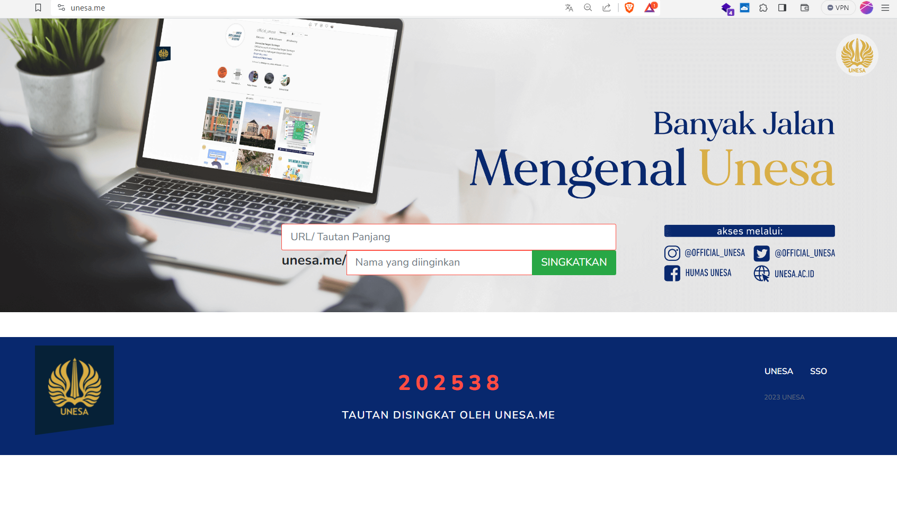

# Revamp UNESA.ME (Unesa URL Shortener) 
Human Computer Interaction (HCI) Project

## What is UNESA.ME?
UNESA.ME is a URL Shortener service for State University of Surabaya. It is a service that takes long URLs and squeezes them into fewer characters to make a link that is easier to share, tweet, or email to friends. Users can create these short links through the web interface at [unesa.me](https://unesa.me).

### Current interface (official)

### Our version (revamped)
